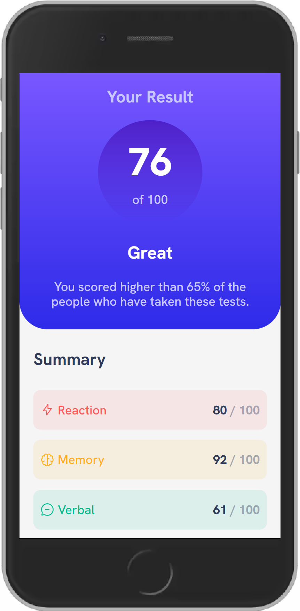
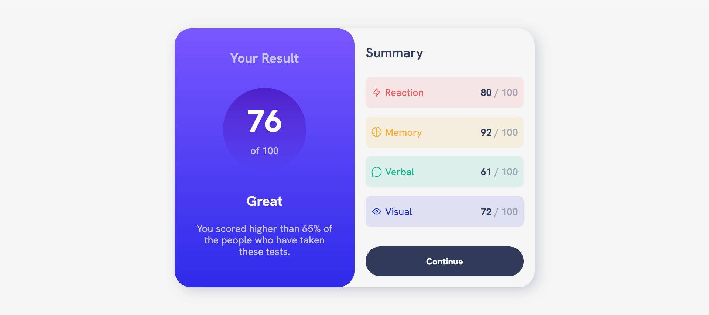

# Results summary component solution - Frontend Mentor

Esta es una solución al desafío [Results summary component de Frontend Mentor](https://www.frontendmentor.io/challenges/results-summary-component-CE_K6s0maV). Los desafíos de Frontend Mentor nos ayudan a mejorar las habilidades de codificación, mediante el desarrollo de proyectos reales.

## Tabla de contenidos

- [Vision general](#vision-general)
  - [El desafio](#el-desafio)
  - [Capturas](#capturas)
  - [Enlaces](#enlaces)
- [Proceso de trabajo](#proceso-de-trabajo)
  - [Desarrollo](#desarrollo)
  - [Lo que aprendi](#lo-que-aprendi)
  - [Lo que aprendere](#lo-que-aprendere)
  - [Recursos](#recursos)
- [Autor](#autor)
- [Agradecimientos](#agradecimientos)

## Vision general

### El desafio

Los usuarios deben ser capaces de:

- Ver el diseño óptimo según el tamaño de pantalla del dispositivo
- Ver estados hover y desplazamiento de los elementos interactivos

### Capturas

Diseño web responsivo que se adapta a pantallas grandes y pequeñas.





### Enlaces

- [Codigo fuente](https://github.com/xantosromerodev/results-summary-component)
- [Pagina web](https://results-summary-component-w.vercel.app/)

## Proceso de trabajo

### Desarrollo

- HTML5 semantico
- Propiedades CSS
- Flexbox
- Grid CSS
- Flujo mobile-first

### Lo que aprendi

Hablando del aspecto personas, aprendí a ser más disciplinado y resiliente para completar este proyecto.

En cuanto al código del proyecto:
- Agregué etiquetas meta dentro del elemento `<head>`
- Utilicé el archivo `normalize.css` para resetear los estilos predeterminados que asigna cada navegador
- Utilicé CSS Grid para alinear los elementos `card__left` y `card__right`
- Utilicé flexbox para manipular las imágenes íconos
- Utilicé variables CSS para no repetir los colores en cada elemento
- Utilicé `media queries` para adaptar el diseño a pantallas grandes

Puedes ver aquí las etiquetas dentro del `<head>`:

```html
<head>
    <meta name="description" content="Results Summary Component">
    <meta name="author" content="Santos Romero">
</head>
```

CSS Grid:
```css
.grid {
    display: grid;
    grid-template-columns: repeat(1, 1fr);
}
```

Flexbox:
```css
.dflex {
    display: flex;
    justify-content: center;
    align-items: center;
}
```

### Lo que aprendere

Seguiré investigando más sobre la **metodología BEM**, las etiquetas `meta` dentro del `<head>` para mejorar el SEO, y las propiedades CSS(especificidad, herencia y cascada).

### Recursos

- [Normalize](https://necolas.github.io/normalize.css/) - Esto me ayudó a resetear todos los estilos predeterminados que el navegador agrega a cada documento HTML
- [BEM Cheat Sheet](https://bem-cheat-sheet.9elements.com/) - Una página web con ejemplos e información sobre la metodología BEM

## Autor

- LinkedIn - [@xantosromero](https://www.linkedin.com/in/xantosromero/)
- Frontend Mentor - [@xantosromero](https://www.frontendmentor.io/profile/xantosromerodev)
- Hashnode - [@xantosromero](https://xantosromero.hashnode.dev/)

## Agradecimientos

Agradezco a Dios por siempre darme valor para vencer la pereza, alejar las distracciones y enfocarme en codificar.

Agradezco a mi madre, y a mis hermanos, por apoyarme con sus palabras de motivación.

También agradezco a mi novia @leidy-marcela, y a mis amigos por acompañarme en este viaje de códigos.
